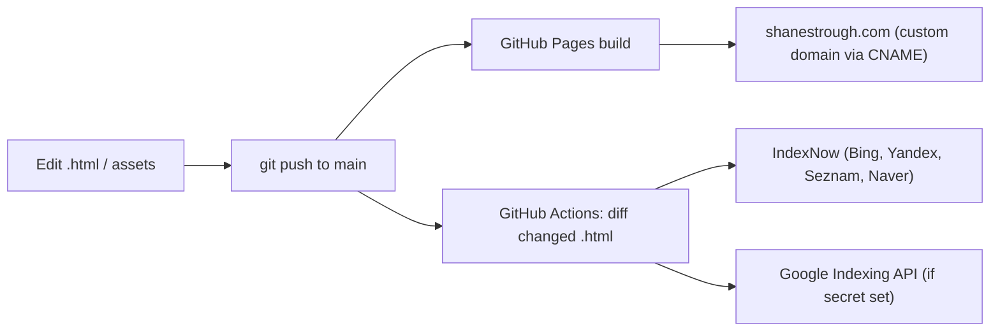

# shanestrough.com

**The personal portfolio, technical writing, and consulting site of Shane Thomas Strough** — Integration & Commissioning Leader. Live at **[shanestrough.com](https://shanestrough.com)**.

A hand-built, dependency-free static website: pure HTML, CSS, and vanilla JavaScript, served straight from GitHub Pages behind a custom domain. No framework, no bundler, no package manager — every page is a self-contained file you can open in a browser.

---

## What's here

- **Portfolio homepage** (`index.html`) — hero, expertise grid, career timeline, services, and contact for director-level commissioning and integration work.
- **About & CV** (`about.html`, `cv.html`) — long-form bio and résumé.
- **Field Notes** (`insights.html`) — a filterable library of technical long-reads, with flagship articles broken out as their own pages (`field-notes-blue-origin.html`, `field-notes-siemens-bas.html`). Source drafts live in `field-notes/` as Markdown.
- **Poetry collection** (`poetry-*.html`) — twelve poem pages ("The Accent of the Soul" and "The Palmarcito Papers"), rendered from source Markdown/PDF kept in `Poetry/`. These pages swap the site's cyan accent for a warm gold (`--warm`).
- **Podcast** (`podcast-stop-the-chaos.html`) — episode page; media assets in `podcasts/`.
- **Photo gallery** (`gallery.html`) — project and field photography from `images/`.

## Features

- **Zero-build, zero-dependency** — nothing to install; edit a file, refresh the browser.
- **Self-contained pages** — all CSS lives in an inline `<style>` block per page; no external stylesheets. JavaScript is vanilla and inline (sticky nav, mobile hamburger menu, article filtering, scroll-triggered card animations).
- **Cohesive design system** via CSS custom properties — electric-cyan accent (`--electric #00E5FF`), warm gold (`--warm #C8A96E`), deep-black surfaces; type set in **Bebas Neue** (headings), **Fraunces** (serif/poetry), and **DM Mono** (body).
- **Scroll animations** — CSS keyframes (`fadeInUp`, `gridPulse`, `glowFloat`) fired by `IntersectionObserver`; poetry pages use a slower `reveal-slow` cadence.
- **Responsive** — breakpoints at 900 / 768 / 600 / 480 px.
- **SEO-first** — per-page JSON-LD (`Person`, `CollectionPage`, `CreativeWork`), Open Graph + Twitter cards, `sitemap.xml`, `robots.txt`, native lazy-loaded images, and Cloudflare-obfuscated contact emails.
- **Automated search-engine indexing** — a GitHub Actions workflow pings IndexNow and the Google Indexing API on every push that touches an `.html` file (see below).

## How it deploys

Two things happen off a single push to the `main` branch: GitHub Pages rebuilds the live site, and a workflow notifies search engines about whichever HTML pages changed.



The indexing workflow (`.github/workflows/index-search-engines.yml`) diffs `HEAD` against its parent for changed `*.html`, then:

1. Batch-submits the URLs to **IndexNow** — one POST fans out to Bing, Yandex, Seznam, Naver, etc. The verification key file `5891ff7061e0f42802e84221382b9ca9.txt` sits at the repo root.
2. Submits each URL to the **Google Indexing API**, minting an OAuth2 token from a self-signed JWT using the `GOOGLE_INDEXING_KEY` service-account secret. This step skips gracefully when the secret isn't configured.

No manual indexing steps are needed.

## Tech stack

- **Content:** HTML5, hand-written per page
- **Styling:** CSS3 with custom properties, inline per page; Google Fonts (Bebas Neue, Fraunces, DM Mono)
- **Behavior:** vanilla JavaScript (no libraries)
- **Hosting:** GitHub Pages + custom domain (`CNAME` → `shanestrough.com`)
- **Automation:** GitHub Actions (IndexNow + Google Indexing API)

## Running it locally

There is no build step. Open any `.html` file directly, or serve the folder to get correct relative paths:

```bash
npx serve .
# or
python -m http.server 8000
```

Then visit `http://localhost:8000`.

## Deploying

GitHub Pages serves from the **`main`** branch; day-to-day work happens on the local **`master`** branch, which is pushed up as:

```bash
git push origin master:main
```

Any push to `main` that changes an `.html` file also triggers the search-engine indexing workflow.

## Project structure

```
.
├── index.html                 # Homepage (hero, expertise, timeline, services, contact)
├── about.html  cv.html         # Bio and résumé
├── insights.html               # Field Notes library (filterable)
├── field-notes-*.html          # Flagship long-form articles
├── poetry-*.html               # Poetry collection (12 pages, warm-gold accent)
├── gallery.html                # Photo gallery
├── podcast-stop-the-chaos.html # Podcast episode
├── field-notes/                # Source Markdown drafts for articles
├── Poetry/                     # Source Markdown / PDF for poems
├── images/  podcasts/  video/  # Media assets
├── sitemap.xml  robots.txt     # SEO
├── favicon.svg  CNAME          # Branding + custom domain
└── .github/workflows/          # Automated search-engine indexing
```

`AGENTS.md` and `CLAUDE.md` carry the working notes and design-system reference for AI/code assistants editing the site — the fullest description of the CSS variables, animation patterns, and navigation conventions lives there.

## Status

Live and in active use. Content (field notes, poetry, gallery, podcast) is added incrementally; the structure and design system are stable.
